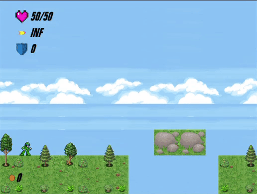
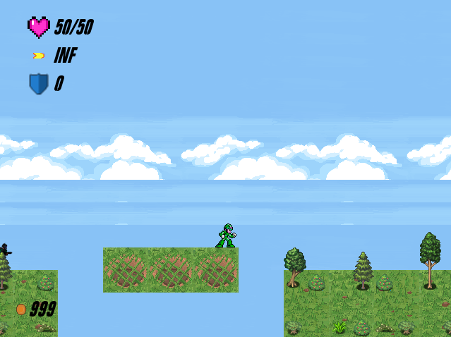
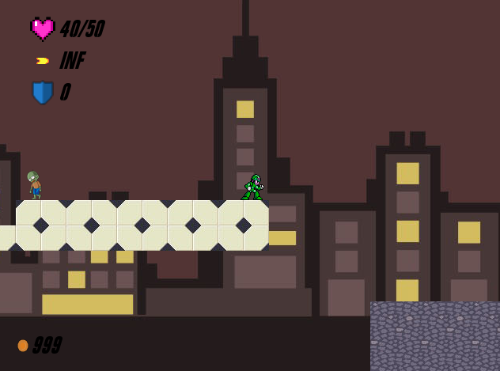
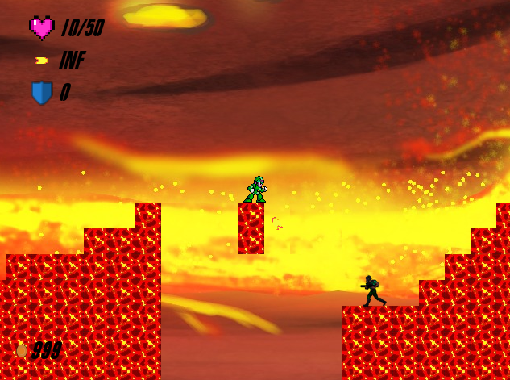
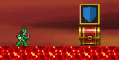
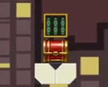
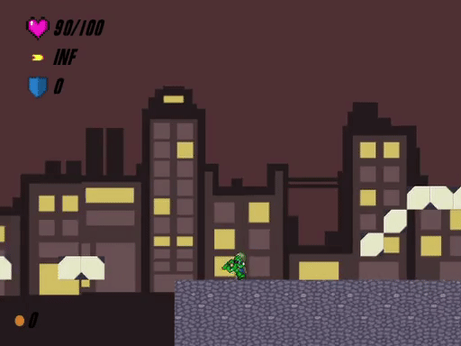
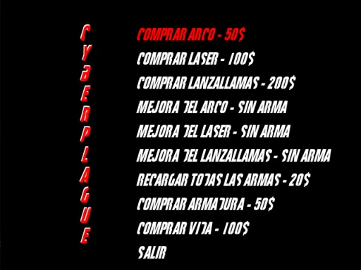

# CyberPlague

Proyecto de la asignatura de Fundamentos de los Videojuegos realizado por un grupo de estudiantes de Ingeniería Multimedia como introducción a la programación de videojuegos utilizando C++ y librerías como SFML y Tiled.

  

# Resumen

CyberPlague es un juego desarrollado en 3 meses que está basado en una mezcla de géneros, los cuales son “Aventura”, “Plataforma” y “Run and gun”. Consta de 3 niveles 2D con scroll lateral hacia la derecha. El jugador dispone de un arma principal y además, tendrá acceso en todo momento a una tienda en la que poder comprar armas, habilidades y mejoras.

Por último, por el mapa se irá encontrando una serie de cofres, que le dará a su elección munición, dinero o vida.

  

# Imágenes del juego

## Niveles

|   |   |   |
|--|--|--|
| 
**Bosque**
 | 
**Ciudad**
 | 
**Infierno**
 |

##  Cofres
  

## Tienda
  

